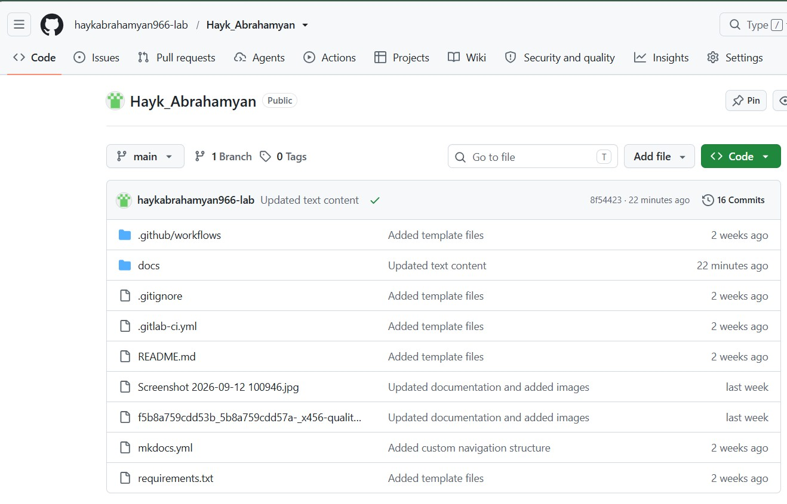
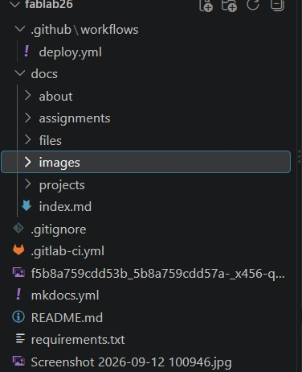

# 1. Սկզբունքներ, գործելակերպ և կայքի ստեղծում

Այս շաբաթ ես աշխատեցի իմ ավարտական նախագծի գաղափարը հստակեցնելու ուղղությամբ և սկսեցի փաստաթղթավորման գործընթացը։

## Research

Fab Academy-ն պաշտոնապես մեկնարկեց սեպտեմբերի 5-ին` սկիզբ դնելով իմ ուսումնառության և գործընթացի փաստաթղթավորման ուղուն: Ուսուցչիս` Fab Lab Armenia-ից Օնիկի ուղղորդմամբ ու աջակցությամբ, ես սկսեցի ուսումնասիրել Fab Academy-ի նախկին ուսանողների աշխատանքները և ծանոթանալ ծրագրի կայքին` հատուկ ուշադրություն դարձնելով «Ուսուցողական նյութեր» (Tutorials) բաժնին: 

Այդ ընթացքում ես առանձնացրի փաստաթղթավորման և տարբերակների կառավարման համար անհրաժեշտ հիմնական գործիքները, այդ թվում` Git-ը` բովանդակությունը կառավարելու և Fab Academy-ի պահոց (repository) վերբեռնելու համար, ինչպես նաև Visual Studio Code-ը` կոդի և Markdown ֆայլերի գրման, խմբագրման ու սպասարկման համար:

---

## 2. Կայքի ստեղծման և կարգավորման քայլաշար

### Քայլ 1․ Ռեպոզիտորիայի կլոնավորում և local միջավայր
* GitHub-ից իմ համակարգիչ քաշեցի `Hayk_Abrahamyan` ռեպոզիտորիան:
* Պրոյեկտի պապկան բացեցի VS Code ծրագրով:
<video width="100%" controls preload="metadata">
  <source src="../videos/R1.mp4" type="video/mp4">
  Քո բրաուզերը չի աջակցում video թեգը:
</video>
* Git Bash տերմինալում կարգավորեցի իմ օգտանունն ու էլ․ հասցեն.
  * `git config --global user.name "Hayk Abrahamyan"`
  * `git config --global user.email "your-email@example.com"`
  <figure markdown>

<figcaption style="font-size: 0.85em; color: #1e88e5; text-align: center;">
  Ահա GitHub-ի վերջնական տեսքը ներբեռնված ֆայլերով:
</figcaption>
</figure>

<figure markdown>

<figcaption style="font-size: 0.85em; color: #1e88e5; text-align: center;">
  Ահա GitHub-ի վերջնական տեսքը ներբեռնված ֆայլերով:
</figcaption>
</figure>
### Քայլ 2․ Deployment-ի խնդրի լուծումը (GitHub Actions)
* Առաջին push-ից հետո GitHub Actions-ի build-ը ձախողվեց:
* **Պատճառը.** GitHub Actions-ին ֆայլեր գրելու թույլտվություն (write permissions) տրված չէր:
* **Լուծումը.** GitHub-ում անցա **Settings > Actions > General > Workflow permissions**, ընտրեցի **Read and write permissions**, պահպանեցի և re-run արեցի workflow-ն:

### Քայլ 3․ Կայքի կառուցվածքը (`mkdocs.yml`)
VS Code-ում բացեցի `mkdocs.yml` ֆայլը և ավելացրեցի `nav` բաժինը՝ կայքի մենյուն ստեղծելու համար․
* Home (`index.md`)
* About (`about/index.md`)
* Assignments (`assignments/week01.md`)
* Final Project (`projects/final-project.md`)

### Քայլ 4․ Էջերի խմբագրում, նկարներ և հղումներ
* Գլխավոր էջը խմբագրելու համար օգտագործեցի `docs/index.md` ֆայլը:
* Նկարները տեղադրեցի `docs/images/` պապկայում և կիրառեցի ճիշտ Markdown սինտաքս. ``
* Հղումները տեղադրեցի ճիշտ փակագծերով. `[Տեքստ](URL)`

### Քայլ 5․ Փոփոխությունների հրապարակում (Git Workflow)
VS Code-ում ֆայլերը պահպանելուց հետո (`Ctrl + S`), տերմինալում հերթով կատարում եմ 3 հրամանները.
1. `git add .`
2. `git commit -m "Updated site documentation"`
3. `git push`

---

## 3. Օգտակար հղումներ

* [Git-ի ներբեռնում Windows-ի համար](https://git-scm.com/install/windows) — սա անհրաժեշտ է վեբ կայքում արված փոփոխությունների պահպանման համար։
* [Visual Studio Code-ի ներբեռնում](https://code.visualstudio.com/download) — կոդի և Markdown ֆայլերի խմբագրման ծրագիր։

# Final Project Proposal: 
## Smart Glasses Stand & Night Light

### Նախագծի համառոտ նկարագիր
Ակնոց կրող մարդկանց համար ամենօրյա խնդիր է գիշերը կամ աշխատանքային սեղանին ակնոցի ճիշտ տեղը գտնելը, ինչպես նաև այն պատահաբար վնասելուց կամ կեղտոտելուց խուսափելը: 

**Smart Glasses Stand**-ը սեղանի խելացի տակդիր է, որը ոչ միայն ապահովում է ակնոցի անվտանգ պահպանումը, այլև ավտոմատ ֆիքսում է ակնոցի առկայությունը և ապահովում հարմարավետ լուսավորություն:

---

### Հիմնական ֆունկցիաները
1. **Automatic Night Light (Ավտոմատ գիշերալամպ):** 
   * Երբ ակնոցը վերցնում ես տակդիրից, փոքրիկ LED լույսը ավտոմատ միանում է՝ մթության մեջ տարածքը լուսավորելու համար:
   * Երբ ակնոցը հետ ես դնում տակդիրի վրա, լույսն ավտոմատ անջատվում է:
2. **Ergonomic 3D Design:** 
   * Հատուկ մշակված դիզայն 3D տպիչով կամ լազերային կտրոնով, որը կանխում է ակնոցի ապակիների քերծվելը:
3. **Compact Electronics:** 
   * Ամբողջ էլեկտրոնիկան և սենսորները թաքցված են տակդիրի պատյանի ներսում:

---

### Բաղադրիչներ
* **Microcontroller:** Arduino Nano / Uno
* **Input Device (Սենսոր):** IR / Proximity Sensor կամ Limit Switch (ակնոցի առկայությունը ֆիքսելու համար)
* **Output Device (Լուսավորություն):** RGB / White LED strip կամ Single LED
* **Power Supply:** 5V USB սնուցում

## Smart Eyeglass Cleaner & Case (UV-C)

### Նախագծի համառոտ նկարագիր
Ակնոցների ապակիներն ու շրջանակը օրվա ընթացքում հավաքում են մեծ քանակությամբ փան, յուղեր և մանրէներ: 

**Smart Eyeglass Case**-ը փակ, պաշտպանիչ տուփ է, որը ոչ միայն պահպանում է ակնոցը մեխանիկական հարվածներից, այլև ավտոմատ ախտահանում է այն ուլտրամանուշակագույն (UV-C) լույսով, երբ ակնոցը տեղադրվում է տուփի մեջ:

---

### Հիմնական ֆունկցիաները
1. **Automatic UV-C Sterilization (Ավտոմատ ախտահանում):** 
   * Տուփի կափարիչը փակելիս սենսորը ֆիքսում է ակնոցի առկայությունը և 2 րոպեով միացնում UV-C LED լույսերը:
   * 2 րոպե անց համակարգը ավտոմատ անջատվում է:
2. **Safety Cut-off (Անվտանգության համակարգ):** 
   * Եթե տուփի կափարիչը բացվի ախտահանման ընթացքում, UV լույսերն ավտոմատ կանջատվեն՝ աչքերը վնասվելուց պաշտպանելու համար:
3. **Compact & Portable Design:** 
   * Հարմար 3D տպված կամ լազերային կտրվածքով պատյան, որը թեթև է և հեշտ տեղափոխվող:

---

### System Architecture & Components (Բաղադրիչներ)

### 1. Hardware & Components (Ապարատային մաս)
* **Microcontroller:** Arduino Nano / ATtiny85 / ESP32
* **Input Devices (Սենսորներ):** 
  * Limit Switch / Reed Switch (կափարիչի փակ լինելը ստուգելու համար)
  * IR Sensor / Microswitch (ակնոցի առկայությունը ֆիքսելու համար)
* **Output Devices:** 
  * UV-C LED (2-4 հատ)
  * Status Indicator RGB LED (կարմիր՝ ախտահանում է, կանաչ՝ պատրաստ է)
* **Power Supply:** Rechargeable Li-Ion battery կամ Power Bank (USB):
